# Projeto - Parte 1 - Gerenciamento de Redes de Computadores

<h3 style="text-align: justify;">Objetivo: Desenvolver uma topologia lógica de um pequeno provedor que atua em 3 cidades. A implementação deve ser feita em Switches, Roteadores e Servidores em Máquinas Virtuais.</h3>

    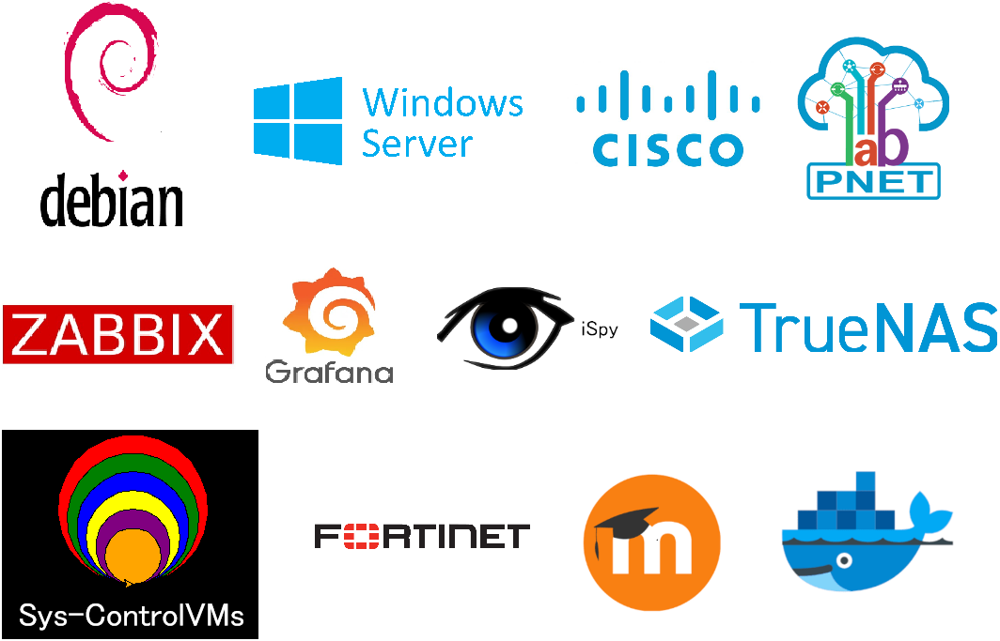

## Sumário

- [Introdução](#introdução)
- [Topologia Lógica](#topologia)
- [Roteamento e Comutação](#rc)
- [Endereçamento e Nomenclatura](#ident)
- [Automação da Rede](#automação)
- [Especificações do laboratório e Máquinas Virtuais](#especificações)
- [Testes Fundamentais](#testes)
- [Licença](#licença)
- [Contato](#contato)

<h3 id="introdução">Introdução</h3>

No cenário dinâmico das redes de computadores, a criação de uma topologia lógica para um provedor de rede operando em três cidades requer uma abordagem meticulosa. Desde as redes locais (LANs) até as redes de longa distância (WANs), os provedores são essenciais para a conectividade digital. Por isso, a topologia lógica apresentada não só envolveu a implementação cuidadosa de switches, roteadores e servidores que atendessem aos requisitos do projeto, como também foi empregado um pouco de automação nas configurações dos dispositivos, especialmente nos roteadores. Todo o projeto foi desenvolvido mediante o uso de máquinas virtuais, com o auxílio do PnetLab, virtualização e emulação QEMU.

<h3 id="topologia">Topologia Lógica</h3>

A Topologia Lógica para o projeto está representada na figura abaixo. Os dispositivos R1, R2 e R3 retratam os roteadores responsáveis por fornecer internet às cidades, que neste caso para R2 e R3 estão representadas por interfaces de Loopback, sendo 2.2.2.2 para R2 e 3.3.3.3 para R3. Já em R1, particularmente na interface e0/0 foi provisionado uma infraestrutura típica de um cliente que contratou os serviços do provedor. Esse cliente foi definido como sendo uma escola pequena, composta pelos setores de recepção/secretaria, corredor, laboratóri de informática (LI), Sala dos professores (SP), Coordenação Pedagógica (CP) e diretoria. Nisso, foram configuradores o fornecimento de alguns serviços, tais como um servidor de arquivos, plataforma de ensino, serviço de Monitoramento, controlador de Domínio, armazenamento DVR, entre outros. Para toda a conexão da escola com a internet, foi configurado um firewall FortiGate, implementado neste caso para monitorar a sessão de rede dos dispositivos locais, bem como o NAT do cliente. Por fim, todo o tráfego de dados para a internet das cidade é feito por R2 (roteador de borda).

    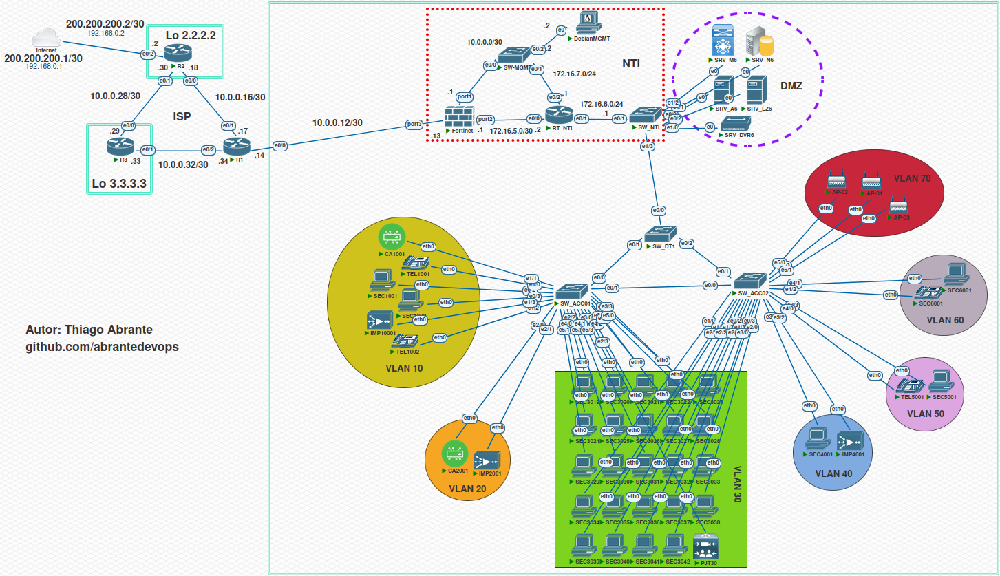

<h3 id="rc">Roteamento e Comutação</h3>

O roteamento realizado no provedor (ISP) consistiu em configurar o protocolo OSPF entre os roteadores R1, R2 e R3 para que suas respectivas redes pudessem se tornar conhecidas. No R2 foram configurados a saída para a internet e o NAT por meio da interface e0/2, por isso, em R3 e R1 o tráfego foi direcionado para R2 mediante rotas default. A rede da cidade representada pela Loopback 3.3.3.3 sai para a internet através da interface e0/0 de R3, já a cidade representada pela Loopback 2.2.2.2 sai para a internet na interface e0/2 de R2. Para a cidade atendida por R1 existe um diferencial, que é a redundância de ter duas alternativas de acesso à WAN, que pode ser tanto pela interface e0/1, quanto pela interface e0/2, por padrão a saída para a internet é feita pela interface e0/1, e caso este link fique indisponível o tráfego é direcionado para a interface e0/2. Nesse contexto supondo então que na cidade delimitada pela área de alcance de R1 exista uma escola que deseja criar uma rede local para o seu ambiente visando uma infraestrutura que possua como requisitos técnicos disponibilidade, desempenho e segurança de rede para os seus usuários. Com isso a escola contratou os serviços do provedor, ao qual foi provisionada uma DMZ com os seguintes serviços:

- Servidor de Arquivos para Backup;
- Servidor de Monitoramento;
- Servidor de Plataforma de Ensino;
- Servidor de Armazenamento DVR;
- Firewall;
- Servidor de Controlador de Domínio

Pensando em uma melhor disposição foi criado uma topologia hierárquica para a rede da escola, sendo o SW_ACC01 e SW_ACC02 responsáveis pelas funções da camada de acesso, SW_DT1 encarregado pela distribuição enquanto que SW_NTI, RT_NTI, SW-MGMT e o Firewall desempenham as tarefas da camada de núcleo. Para cada setor da escola foi pensado ser um domínio de broadcast diferente, dessa forma, foram configurados ao todo 7 VLANs que representam os setores da escola, onde apenas a última VLAN (70 - Wifi) não possuia acesso aos serviços da escola. No RT_NTI foi configurado um servidor DHCP, bem como feita toda a lógica de subinterfaces de gateway para cada uma das VLANs, além disso também foram inseridas ACLs com o intuito de fazer com que as VLANs não se comunicassem entre sí, exceto em alguns casos como por exemplo a VLAN 20 (Corredor) que possui equipamentos de impressão, por fim ainda em RT_NTI foi configurado uma rota default apontado para o Firewall. A configuração do Firewall teve como objetivo monitorar a sessão de rede dos dispositivos locais, bem como o NAT do cliente, para isso foram utilizadas 3 portas do Firewal, a porta 1 (MGMT) para o acesso e gerenciamento do equipamento, porta 2 (LAN) para o controle/manutenção da rede da escola e a porta 3 (WAN) como saída para à internet.

Obs.: Em termos didáticos para que o acesso à internet do provedor no laboratório fosse possível, a interface e0/2 (WAN) do R2 foi configurada com o endereço da minha rede local 192.168.0.0/24.

<h3 id="ident">Endereçamento e Nomenclatura</h3>

Para a identificação dos dispositivos da rede em termos de endereçamento IP e nomenclatura dos dispositivo, foi utilizado o seguinte padrão:

    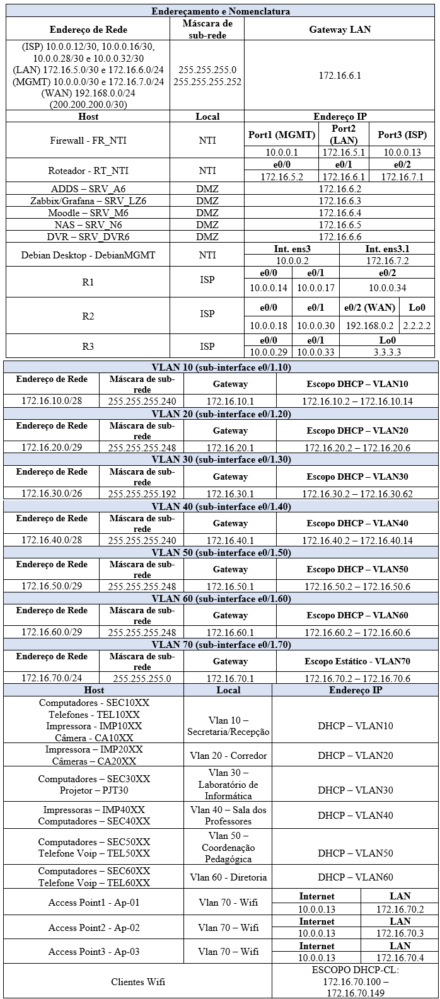

<h3 id="automação">Automação da Rede</h3>

Em certos pontos da topologia, foi empregado um pouco de automação para a configuração dos roteadores. Para isso, foi utilizado o Python e a biblioteca Paramiko para estabelecer uma conexão com os dispositivos. Antes de executar cada um dos arquivos, é necessário conferir se as verificações específicas foram atendidas, esses requisitos estão comentados nas primeiras linhas de cada um dos arquivo. Por padrão esses arquivos estão localizados no diretório home do usuário thiago na vm debianMGMT, mas também podem ser encontrados encontrado neste repositório no diretório setup\autpz.  Abaixo, segue um breve exemplo de como foi feito a configuração do RT_NTI.

    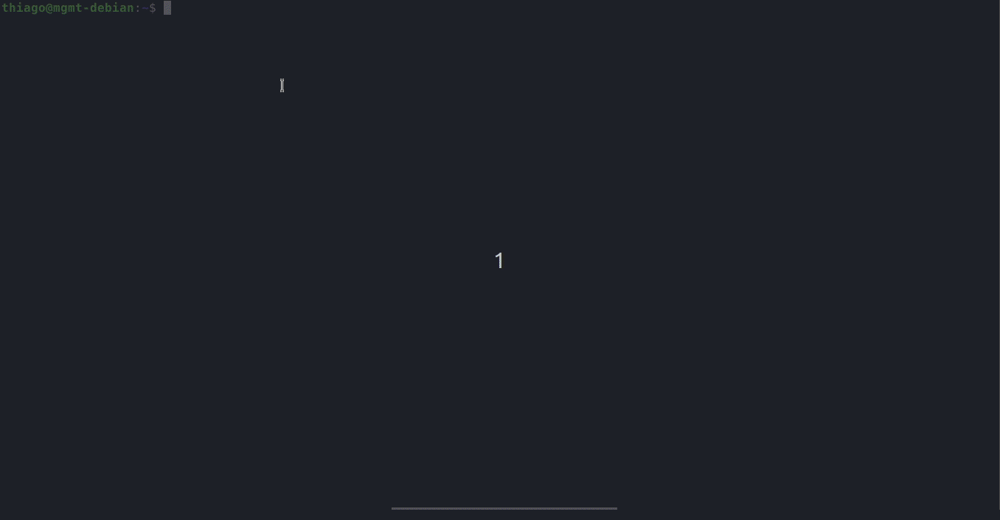
    
Automação com Python no RT_NTI.

<h3 id="especificações">Especificações do laboratório e Máquinas Virtuais</h3>

Inicialmente foi realizado o donwload do PnetLab seguindo a documentação disponibilizada na página oficial. Em seguida, com o auxílio do virtualbox foi iniciado a VM do Pnetlab ao qual após o processo de instalação e pelo fato da conexão estar em modo bridge, foi possível acessar a interface web do PnetLab pelo navegador no endereço disponibilizado pelo servidor DHCP da minha rede http://192.168.0.0/24.

    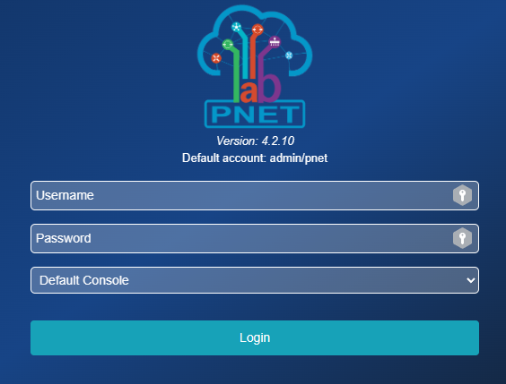
    
Login no PnetLab em http://192.168.0.21

Após o login, foi criado um "novo arquivo" para representar a construção do projeto através da adição de todos os dispositivos mostrados na topologia lógica.

- Roteadores e Switches do Projeto

As especificações dos Roteadores e Switches foram definidas através da imagem Cisco IOL L2/L3 adventerprisek9, sendo utilizado os valores padrões de processamento e memória.

- DMZ e NTI

Para os servidores M6 (Moodle), LZ6(Zabbix/Grafana), N6(TrueNAS), DVR6, DebianMGMT e A6 (ADDS) foram desenvolvidas máquinas virtuais KVM com o auxílio do software Sys-ControlVMs (https://github.com/abrantedevops/Sys-ControlVMs). Essencialmente, as especificações foram definidas como sendo:
    
     Servidores:
        - Debian 11 bullseye
        - 1 vCPU
        - 1 GB de memória RAM
        - 10 GB de HD
        - Softwares: Docker e Docker-compose previamente instalados  
    
     DebianMGMT:
        - Debian 11 bullseye com interface gráfica XFCE
        - 3 vCPU
        - 4 GB de memória RAM
        - 8 GB de HD
        - Biblioteca Paramiko previamente instalada

     SRV_A6:
        - Windows Server 2022
        - 4 vCPU
        - 4 GB de memória RAM
        - 50 GB de HD

O firewall FortiGate foi configurado a partir de uma imagem qcow2 disponibilizada pelo fabricante com as seguintes especificações:

    FortiGate:
        - FortiGate-VM64-KVM
        - 1 vCPU
        - 1 GB de memória RAM

Para que todos os serviços pudessem funcionar sem grandes problemas de desempenho, foi necessário alocar recursos de hardware suficientes para a VM do PnetLab. Nisso, foi definido 6 vCPUs, 10 GB de memória RAM, 100 GB de armazenamento e 1 placa de rede em modo bridge. Além disso, foi habilitado a virtualização aninhada (nested virtualization) através da opção "VT-x/AMD-V" no Virtualbox. A figura abaixo retrata o uso dos recursos da VM do PnetLab durante durante a execução dos dispositivos.

    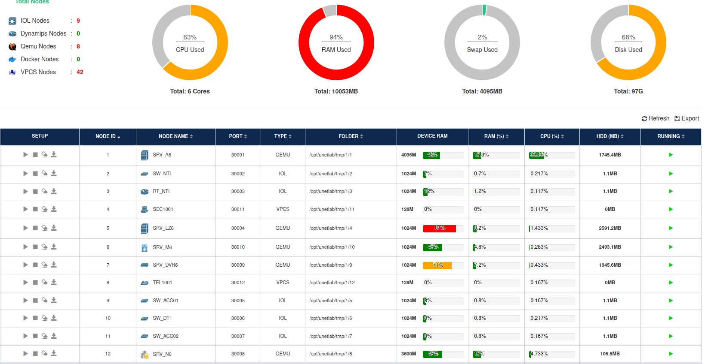
    
Utilização dos Recursos da VM do PnetLab.

Obs.: É importante salientar que apesar de ter definido recursos consideráveis para a VM do PnetLab, o laboratório do projeto pode ser executado com menos recursos, desde que não seja utilizado todos os servidores ao mesmo tempo. De qualquer forma, caso opte por alterar os recursos é indicado fazer testes de desempenho para verificar se a VM do PnetLab está conseguindo atender a demanda dos servidores e/ou dispositivos. Todas as máquinas virtuais, bem como o laboratório do projeto estão disponíveis no diretório setup.

<h3 id="testes">Testes Fundamentais</h3>

 - <h4>Roteamento e Conectividade</h4>

    
Foram selecionados alguns testes envolvendo a conectividade para avaliar o configuração do roteamento fornecida pelo ISP, bem como o acesso à internet e a redundância da rede contratada pelo cliente em caso de falha de um dos links de R1. Os testes foram feitos a partir dos roteadores do provedor e também de alguns Hosts do cliente. Os momentos destacados abaixo retratam que os resultados obtidos foram os esperados.

    

        

            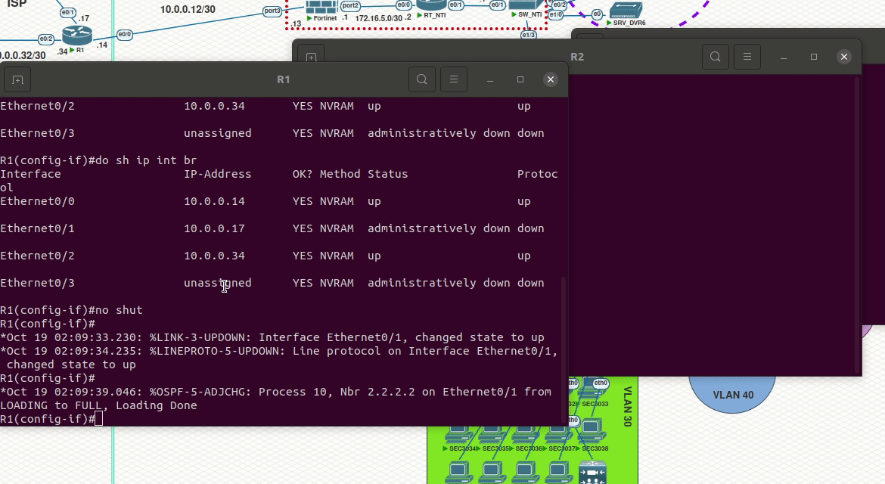
            
Roteamento das cidades disponibilizado pelo ISP

        

        

            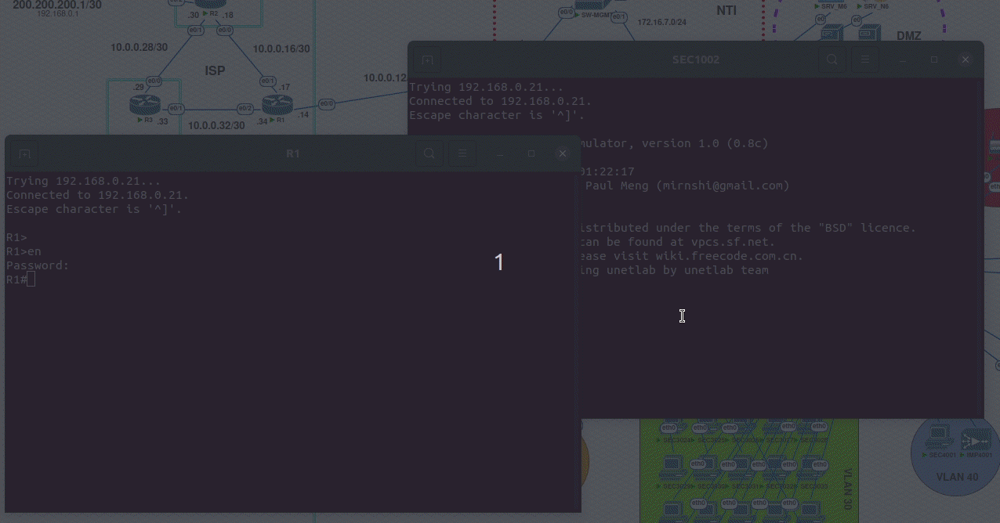
            
Acesso à internet mantido mesmo após a queda forçada do link principal de R1. Teste feito em uma máquina da VLAN 10, cujo endereçamento foi fornecido pelo DHCP da rede do cliente.

        

    

  - <h4>Serviços Disponibilizados</h4>

    
A maioria dos serviços configurados na DMZ foram provisionados a partir da utilização do docker-compose, cujo arquivo yml pode ser encontrados neste repositório no diretório setup. O restante dos serviços da DMZ, ou seja o TrueNAS e o ADDS foram configurados diretamente nas máquinas virtuais. Já na área do NTI, o firewall e o debianMGMT também são virtualizações QEMU. O preview destacado abaixo foi feito a partir da vm debianMGMT no NTI, sendo possível observar o funcionamento dos serviços disponibilizados na rede da escola após toda a configuração. 

    

    

    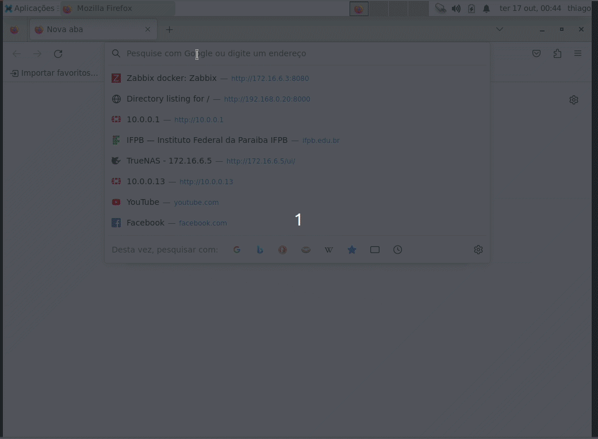
    
Monitoramento Zabbix.

    

    

    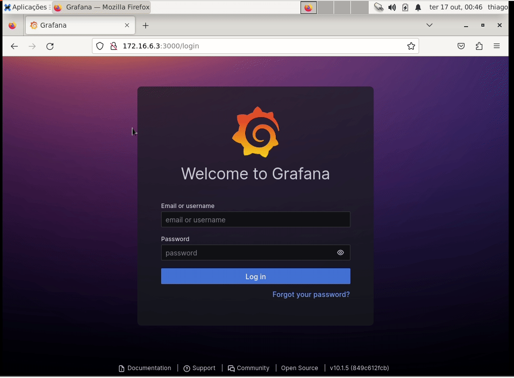
    
Grafana.

    

    

        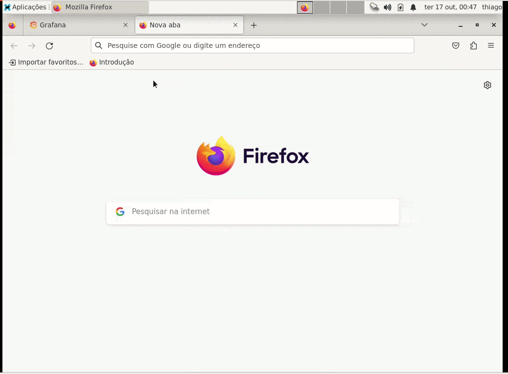
        
iSpy.

    

    

        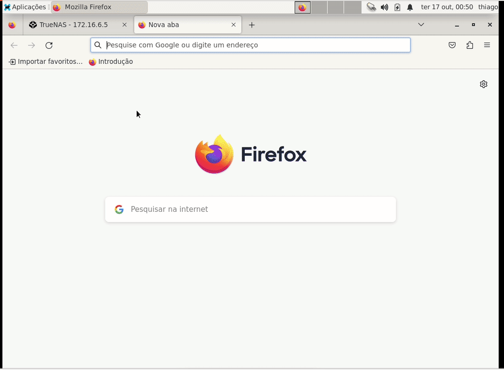
        
FortiGate.

    

    

    

    

        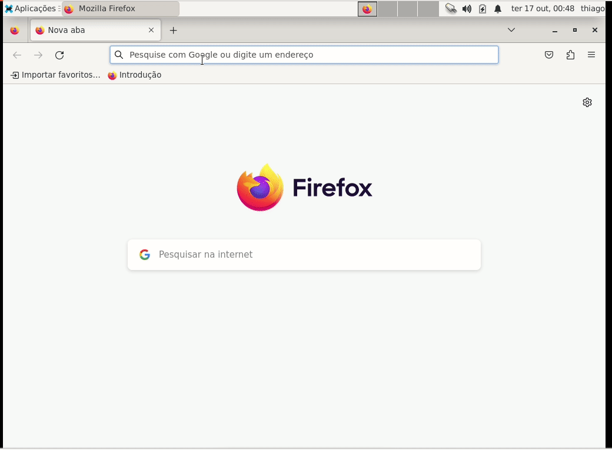
        
Moodle.

    

    

        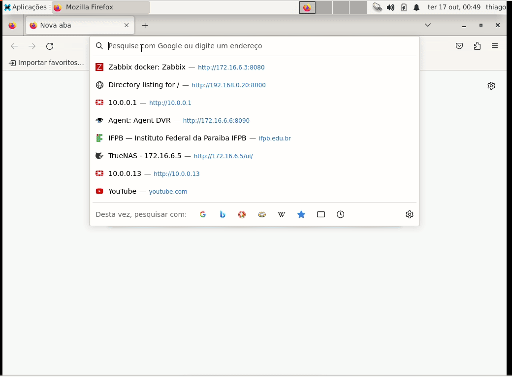
        
TrueNAS.

    

    

        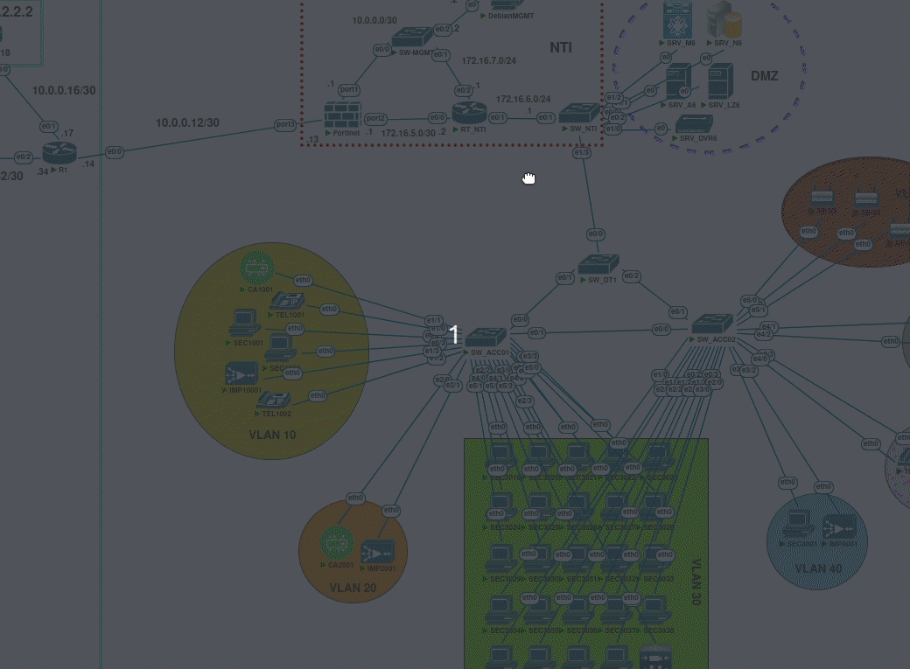
        
Controlador de Domínio ADDS.

    

    

<h3 id="licença">Licença</h3>

MIT License

Copyright (c) 2012-2023 Thiago Abrante

Permission is hereby granted, free of charge, to any person obtaining a copy of this software and associated documentation files (the "Software"), to deal in the Software without restriction, including without limitation the rights to use, copy, modify, merge, publish, distribute, sublicense, and/or sell copies of the Software, and to permit persons to whom the Software is furnished to do so, subject to the following conditions:

The above copyright notice and this permission notice shall be included in all copies or substantial portions of the Software.

THE SOFTWARE IS PROVIDED "AS IS", WITHOUT WARRANTY OF ANY KIND, EXPRESS OR IMPLIED, INCLUDING BUT NOT LIMITED TO THE WARRANTIES OF MERCHANTABILITY, FITNESS FOR A PARTICULAR PURPOSE AND NONINFRINGEMENT. IN NO EVENT SHALL THE AUTHORS OR COPYRIGHT HOLDERS BE LIABLE FOR ANY CLAIM, DAMAGES OR OTHER LIABILITY, WHETHER IN AN ACTION OF CONTRACT, TORT OR OTHERWISE, ARISING FROM, OUT OF OR IN CONNECTION WITH THE SOFTWARE OR THE USE OR OTHER DEALINGS IN THE SOFTWARE. 

<h3 id="contato">Contato</h3>

<a href="mailto:thiago.abrante@academico.ifpb.edu.br" target="_blank">Thiago Abrante</a>